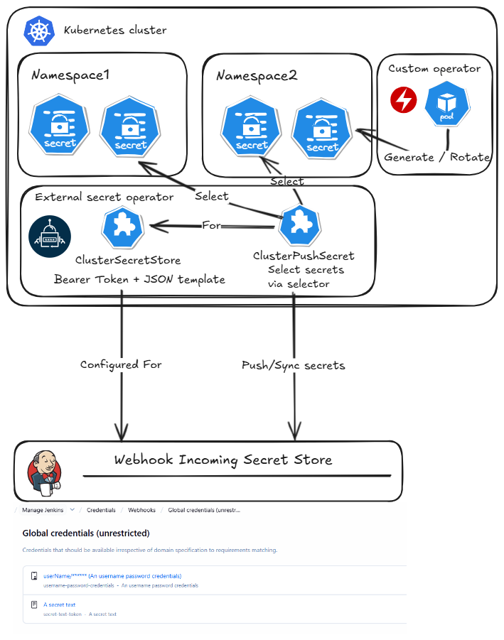
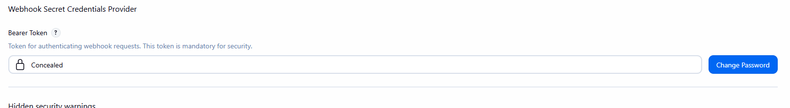

# Webhook Secret Credentials Provider Plugin

A Jenkins plugin that allows external systems to provide global credentials to Jenkins via external incoming webhook via HTTP POST requests protected by a Bearer token authentication.

This enables dynamic credential update from external systems (that can execute webhooks) or infrastructure automation tools when pull model is not possible.

> [!WARNING]  
> Secret are stored in memory and NOT persisted to disk. Make sure your system executing webhook update secrets are regular.
> As a result, it does not support High Availability (HA) or clustered Jenkins environments (such as CloudBees CI HA).
> Future improvement will include persistence if such limitation is a blocker in the future.

If you are not clear about the next use case, you probably want to take a look at following plugins instead
 - [Kubernetes Credentials Provider Plugin](https://plugins.jenkins.io/kubernetes-credentials-provider/) to fetch credentials from Kubernetes Secrets
 - [Vault Credentials Provider Plugin](https://plugins.jenkins.io/hashicorp-vault-plugin/) to fetch credentials from HashiCorp Vault
 - [Azure Key Vault Credentials Provider Plugin](https://plugins.jenkins.io/azure-keyvault/) to fetch credentials from Azure Key Vault
 - [Bitwarden Credentials Provider Plugin](https://plugins.jenkins.io/bitwarden-credentials-provider/) to fetch credentials from Bitwarden

# Use Case

One of the use case is to have Kubernetes `Secret` in various Kubernetes clusters and namespaces and a Jenkins controller on a totally different infrastructure. 

Having such credentials synchronized is critical specially when using short living token (like few minutes).

Using the [External secret operator](https://external-secrets.io/) and [PushSecret](https://external-secrets.io/latest/api/pushsecret/) via [Webhook Provider](https://external-secrets.io/latest/api/generator/webhook/) could rely on such API to keep the secret in sync.



## Configuration

### Bearer Token Authentication

This plugin **requires** Bearer token authentication. All webhook requests must include a valid Bearer token.

1. Navigate to **Manage Jenkins** > **Security**
2. Find the **Webhook Secret Credentials Provider** section
3. Set a strong Bearer token in the **Bearer Token** field
4. Save the configuration



### Webhook Endpoint

The plugin exposes a single webhook endpoint at:
```
POST {JENKINS_URL}/webhook-credentials/update
```

**Authentication Required:** All requests must include the Authorization header:
```
Authorization: Bearer <your-configured-token>
```

## Usage

### Sending Credentials via Webhook

Send HTTP POST requests to the webhook endpoint with JSON payloads containing credential data and proper authentication.

**All requests must include the Bearer token in the Authorization header.**

#### StringCredentials (secretText)

```bash
http POST :8080/jenkins/webhook-credentials/update \
  "Authorization:Bearer <your-token>" \
  id=secret-text-token \
  description="A secret text" \
  type=secretText \
  "secret[token]=1234"
```

#### UsernamePasswordCredentials (usernamePassword)

```bash
http POST :8080/jenkins/webhook-credentials/update \
  "Authorization:Bearer <your-token>" \
  id=username-password-credentials \
  description="An username password credentials" \
  type=usernamePassword \
  "secret[username]=userName" \
  "secret[password]=password123"
```

## Jenkins configuration as code

```yaml
security:
  webhookSecretStore:
    token: "a very insecure token"
```

## License

This plugin is licensed under the MIT License.
